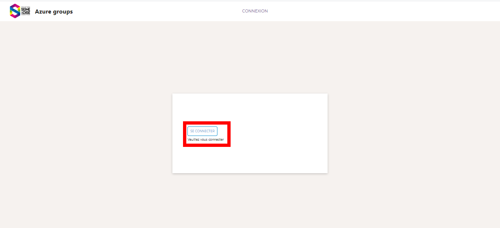
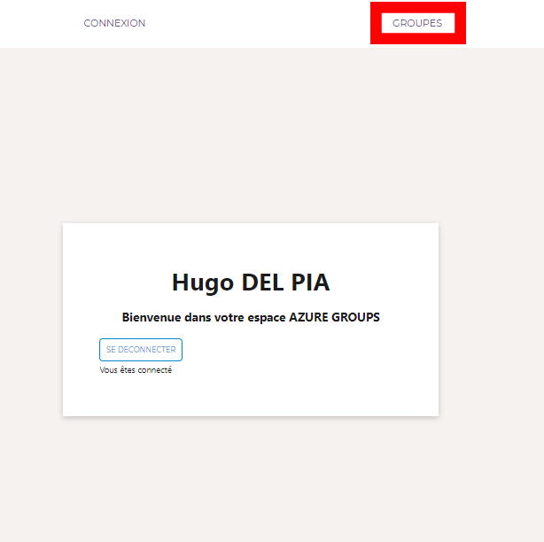
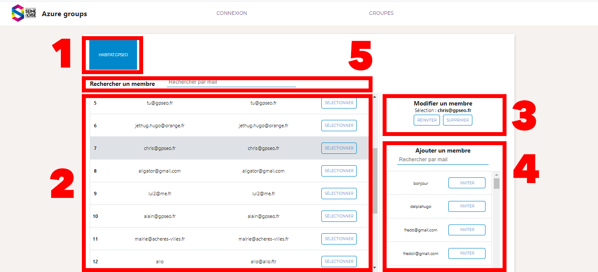
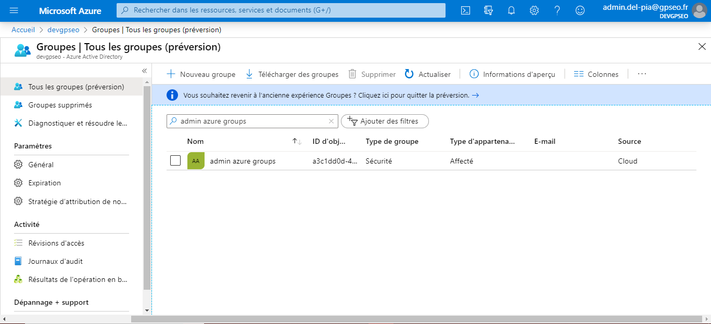
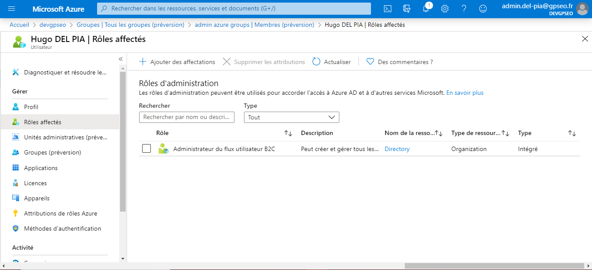
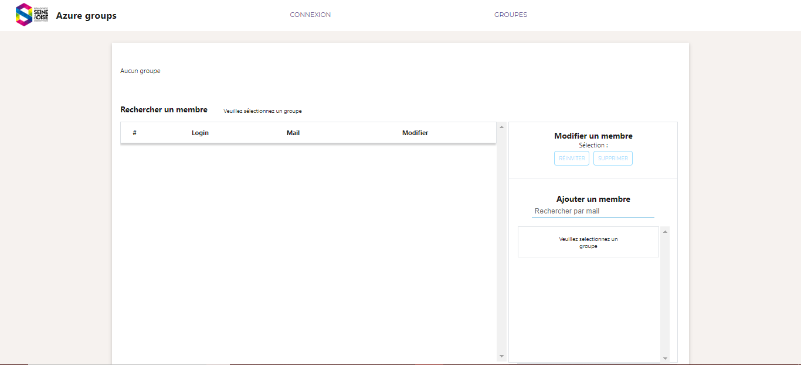
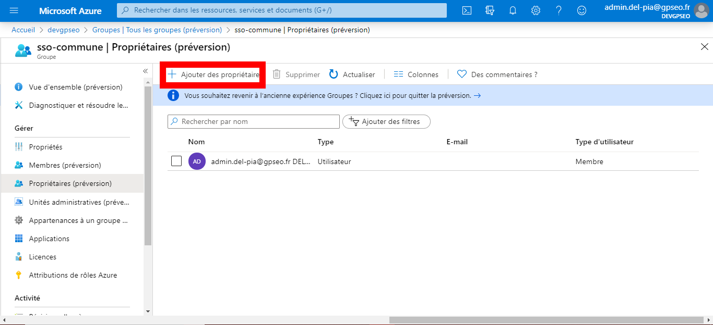

# Azure Group - Application d'accès relative aux plateformes

## Usage

### Connexion 
Voici la première page sur laquelle vous arrivez. Veuillez vous connecter directement avec votre compte administrateur Azure-Groups ( pas de compte admin ? Voir directement la partie **Ajouter un administrateur** )


Une fois connecté, vous devriez voir **Groupes** ajouté dans votre barre de navigation


### Groupes
Le controle des membres se fait ici :

1. Groupes dont vous avez la possibilité de modifier, veuillez en sélectioner un pour pouvoir modifier son contenu.
2. Liste courante des membres du groupe sélectionné plus haut. Une sélection de chaque membre est possible pour ensuite le modifier.
3. Après avoir sélectionné un membre. Vous avez la possibilité de supprimer son affection au groupe ( et uniquement son affectation ) ou de le réinviter.
4. Ajouter un membre se fait en 2 étapes : rechercher l'utilisateur dans la base de données, ajouter l'utilisateur avec le bouton **Inviter**.
5. Une barre de recherche est disponible pour filtrer les membres du groupes pour une modification rapide


## Ajouter un administrateur

### Ajouter l'administrateur à l'application
Connectez à l'Azure AD de GPSEO et rechercher dans les groupes **admin-azure-groups**


Ajoutez les membres que vous désirez, affectez ensuite le rôle suivant : **Administrateur du flux utilisateur B2C** (Ajouter un membre > Double cliquez sur le membre > Rôles affectés )


L'administrateur peut accéder maintenant à l'application.

### Ajouter l'administrateur aux groupes
Si votre administrateur essayerai de se connecter puis d'accéder aux groupes. Il verrait la page **Groupes** ainsi : 


Il faut donc ajouter l'administrateur en tant que propriétaire parmi la liste de groupe d'Azure AD ( Voir **Ajouter un nouveau groupe** pour plus d'informations sur les groupes ) 



## Ajouter un nouveau groupe

### Récupérer l'ID du groupe
Créez ou sélectionnez le groupe que vous voulez ajouter à l'application. Nous en aurons besoin pour plus tard.


### Ajouter le groupe dans les fichiers
Veuillez vous connecter au serveur FTP du site web GPSEO et accéder aux dossiers de l'application Azure Groups. Puis naviguer dans **src/env/Groups.js**. Il devrait ressembler à ci-dessous:

```
module.exports = [
  {
    name : "Habitat.gpseo", //Nom affiché dans l'application
    id : "ee109a66-f87d-4933-8cc1-562047148e39" //ID objet récupéré
  },
  {
    name : "Communes.gpseo",
    id : "325b8174-e8ad-45dd-94c1-94ee8da896f1"
  },
  //Votre code ici
  {
    name: "",
    id: ""
  },
  //Fin de votre code
];
```
Copier coller le contenu de **Votre code ici** avec *l'ID Objet* récupéré dans la section précédente. Donnez lui un nom et votre groupe est ajouté. 

Suivez ensuite les consignes de **Ajouter un administrateur** pour garantir son utilisation


## Fonctionnement 