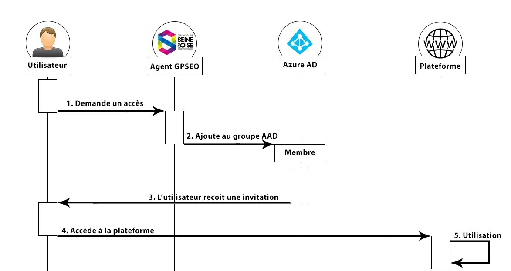

# Application relative d'accès aux plateformes

Voici un schéma réprensentant l'utilisation de l'application dans son environnement

## Utilisation

> Veuillez vous connecter avec un compte Microsoft pour accéder à l'application

### Listes de groupes
Les groupes que vous pouvez modifier se trouve en haut (1). Il faut d'abord **afficher les groupes**.

### Listes de membres
Après selectionné un groupe, les membres de celui-ci s'affiche sous forme de liste (2)

### Selectionner un membre
Tout les membres sont sélectionnables , plusieurs options s'offrent à vous (3) :
- Ré-inviter le membre, dans le cas où l'utilisateur n'a pas crée son compte par exemple
- Supprimer un membre du groupe

### Ajouter un membre
Pour ajouter des membres aux groupes (4) :  
1. Rechercher un utilisateur via son adresse mail
2. Soit il est existant, l'appli reconnait son profil. Soit, il n'est pas dans la base de données, il recevra une invitation à rejoindre l'annuaire de GPSEO avec un compte Microsoft.
3. Une fois ajouté, il est listé parmi les membres.

### Rechercher un membre
La fonction rechercher permet de filtrer les membres. La recherche se fait par mail (5).

## Administration
> Seuls les personnes connaissant Azure AD sont aptes à administrer les groupes

### Ajouter un groupe à une personne
L'application affiche les groupes dont l'utilisateur courant est propriétaire ET membre dans l'azure AD. Pour ajouter un groupe à l'application pour un utilisateur quelconque. Celui ci doit être propriétaire ET membre d'un groupe, tout simplement.

## Modification du code 

Afin de modifer l'application et de coder de nouvelles fonctionnalités. Il faut, une fois les modifications faites dans les différents fichiers de l'application. Buildez l'application. Transferez le dossier "build" dans le serveur FTP. Effacez le dossier "public" du serveur puis renommez le dossier "build" en "public".
